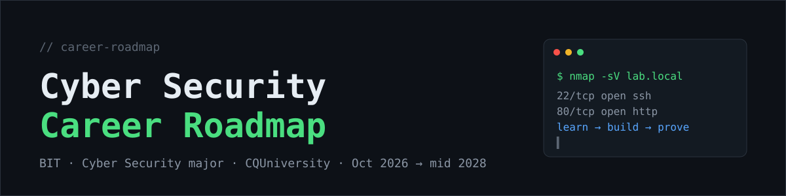
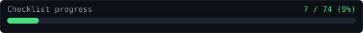
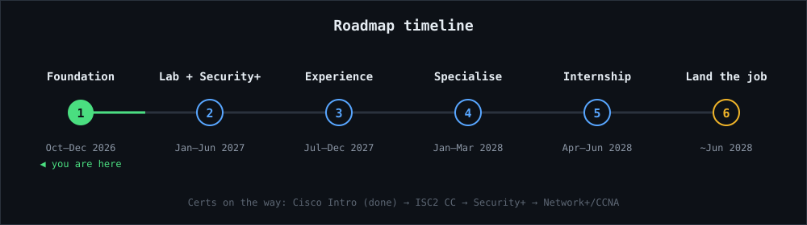

<p align="center">
  
</p>

# Cyber Security Career Roadmap

https://abisheksapkota-spec.github.io/cyber-career-roadmap/

My plan to land my first IT / cyber security job while studying the **Bachelor of Information Technology (Cyber Security major, App Dev minor)** at CQUniversity. Everything lives in this repo: roadmap, checklist, daily log, notes, writeups and projects.

## Progress

<!-- PROGRESS:START -->
| | |
|---|---|
| Checklist | **3 / 74** (4%) |
| Current streak | **1** day |
| Longest streak | 1 day |
| Days logged | 1 |
| Last 14 days | ⬜⬜⬜⬜⬜⬜⬜⬜⬜⬜⬜⬜⬜🟩 |
| As of | 2026-10-08 |
| Already done | 3 / 3 |
| Part 1: 3-month holiday plan (8 Oct 2026 to 7 Jan 2027) | 0 / 38 |
| Part 2: Career roadmap to graduation (mid 2028) | 0 / 33 |


<!-- PROGRESS:END -->

*This block updates automatically when you commit changes to `CHECKLIST.md` or add a file in `daily-log/`.*

## Timeline



| Phase | When | Focus |
|---|---|---|
| 1. Foundation | Oct to Dec 2026 | Linux, networking, Python, TryHackMe, home lab, ISC2 CC |
| 2. Lab + Security+ | Jan to Jun 2027 | CompTIA Security+, uni club, writeups |
| 3. Experience | Jul to Dec 2027 | Casual IT job, CTFs, Network+ or CCNA |
| 4. Specialise | Jan to Mar 2028 | Pick SOC, pentest or GRC, apply |
| 5. Internship | Apr to Jun 2028 | 3-month internship and job hunt |
| 6. Land the job | ~Jun 2028 | Convert internship or accept an offer |

## Start here

| I want to... | Open |
|---|---|
| See today's streak, log my day, jump to everything | [index.html](index.html) (dashboard, works on GitHub Pages) |
| Tick off tasks | [CHECKLIST.md](CHECKLIST.md) |
| See the 3-month holiday plan as a tracker | [tracker/holiday-3-months.html](tracker/holiday-3-months.html) |
| See the long-term roadmap as a tracker | [tracker/career-roadmap.html](tracker/career-roadmap.html) |
| Read the full roadmap | [docs/ROADMAP.md](docs/ROADMAP.md) |
| Plan certificates | [docs/CERTIFICATIONS.md](docs/CERTIFICATIONS.md) |
| Find a link | [docs/RESOURCES.md](docs/RESOURCES.md) |
| Chase scholarships | [docs/SCHOLARSHIPS.md](docs/SCHOLARSHIPS.md) |
| Plan my day | [docs/DAILY-ROUTINE.md](docs/DAILY-ROUTINE.md) |

## Set it up (10 minutes)

1. Create a new repo on GitHub (for example `cyber-career-roadmap`). Public is fine, it doubles as a portfolio.
2. Upload everything from this folder: on the repo page choose **Add file > Upload files** and drag in all the contents, including the hidden `.github` folder. (Or use git: `git init`, `git add .`, `git commit -m "Initial roadmap"`, `git branch -M main`, `git remote add origin <your-repo-url>`, `git push -u origin main`.)
3. Turn on the dashboard: **Settings > Pages > Build and deployment > Deploy from a branch > main / (root) > Save**.
4. Your dashboard will be at `https://YOUR-USERNAME.github.io/REPO-NAME/` after a minute or two.
5. Allow the progress Action to commit: **Settings > Actions > General > Workflow permissions > Read and write permissions > Save**.

## Daily workflow

1. Open the dashboard, set the repo name once (top of the page), and tap **Create today's log on GitHub**. It opens a prefilled new file. Fill it in and commit.
2. Open `CHECKLIST.md`, tap the pencil, change `[ ]` to `[x]` for what you finished, commit.
3. The Action updates the progress and streak above within a minute.

The HTML trackers and dashboard save their ticks in your browser only. `CHECKLIST.md` and `daily-log/` are saved in the repo, so treat those as the official record.

## Repo map

```
.
├── index.html            Dashboard: streak, heatmap, links
├── CHECKLIST.md          Master checklist (source of truth)
├── tracker/              Interactive HTML trackers
├── docs/                 Roadmap, certs, resources, scholarships, routine
├── daily-log/            One file per day (drives your streak)
├── notes/                Your summaries
├── writeups/             TryHackMe / HackTheBox / CTF writeups
├── labs/                 Home lab documentation
├── projects/             Scripts and tools you build
├── assets/               Banner, timeline, progress images
├── scripts/              update_progress.py
└── .github/workflows/    Auto-update action
```

## Rules I follow

- Skills, certs and projects over everything else.
- Show my work in public: writeups, lab READMEs, LinkedIn posts.
- Practise only on machines I own or platforms that allow it.
- Spend money on exam vouchers, not on fee-based placement programmes.
- Check my student visa work-hour limits before taking any work.
