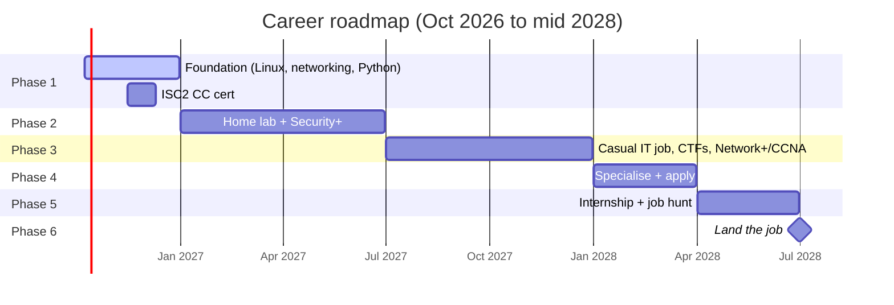

# Roadmap

## Phase 1: Foundation (now to Dec 2026)

- Linux, networking, Python basics
- TryHackMe Pre Security, Sad Servers, home lab
- GitHub, LinkedIn, Discord communities
- ISC2 CC cert
- Detailed weekly plan: see the 3-month section of [CHECKLIST.md](../CHECKLIST.md)

## Phase 2: Lab and first big cert (Jan to Jun 2027)

- Pass CompTIA Security+
- Join or start the uni cyber security club
- Keep writing CTF writeups and posting milestones on LinkedIn

## Phase 3: Real experience (Jul to Dec 2027)

- Casual IT helpdesk or support job (check visa work hours first)
- Weekly CTFs, beginner bug bounty attempt
- Network+ or CCNA

## Phase 4: Specialise and get visible (Jan to Mar 2028)

- Pick a focus: SOC analyst, pentesting or GRC
- Reach out to recruiters and hiring managers
- Research your uni's internship partners and start applying

## Phase 5: Internship and job hunt (Apr to Jun 2028)

- 3-month internship, treated as a 3-month interview
- Apply externally in parallel
- Practise technical interview scenarios weekly

## Phase 6: Land the job (around graduation)

- Convert the internship or accept an external offer
- Update LinkedIn

## Rules of thumb

1. Skills, certs and projects beat everything else on a junior security CV.
2. Show your work: GitHub writeups, lab READMEs, LinkedIn posts.
3. Do not pay for placement programmes. A real job pays you.
4. Check your student visa work-hour limits before taking any work.
